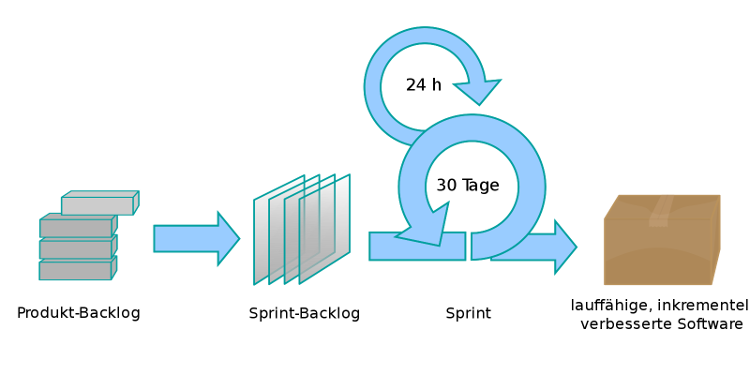

# Agile software development

---

## What is software engineering?

- Building software
- One shot implementation is impossible
- Cost of change
    - Exponential development effort (product complexity)
    - Logarithmic developer productivity (product complexity)

---

## What is software engineering?

- Professionalism (in quality, in time, in budget)
- Phases
    - Plan
    - Design
    - Build
    - Test
    - Review
    - Deploy

---

## Tools

- Programming language
- IDE
- Debugger
- VCS
- Static code analysis

---

## Software development processes

- Sequential
    - Waterfall
    - V-Model
- Agile (incremental)
    - Scrum
    - Extreme Programming (XP)
---

## Waterfall process

---

## V-Model

---

## Scrum

---

## Choosing the right software development processes

- Important
- Criteria
    - Requirements complete
    - Risk (domain, technologies, ...)
    - Schedule (time, ressources, ...)
    - Interaction with customer/management

---

## Why agile (1/2)

- Why sequential models were used in the past
    - Upfront planning to detect errors early
    - Models/documents are cheaper than code

---

## Why agile (2/2)

- Why agile models are used today
    - Code got cheaper to produce
    - Cheap and faster hardware
    - Compile & excution time
    - High level programming languages
    - Test automation
    - Code generation
    - Static code analysis
    - Upfront work is liability
    - Plans change over time

---

## Agile manifesto

- Published February 2001 by 17 developers
- Focus on code
- People over processes
- Iterative approach
- Customer involvement
- Requirements will change
- Simplicity
- http://agilemanifesto.org/

---

## Questions

---

# Agile paper planes

---

## Goals & Rules

- Build as many flyable paper planes as you can
- Planes must fly a specified distance 
- One player can only do one fold at a time
- One player
    - Counts planes (#Ok, #Nok, #WIP, #Estimated)
    - Stopps time
- Final score = #Tested - #WIP

---

## Iteration

- 3 minutes planning + Estimate the planes built
- 3 minutes build & test
- 3 minutes review

---

## Review

- What made you improve over the iterations?
- How would a waterfall plane building process look like?

---

# Scrum basics

---

## Scrum roles

- Product owner
- Scrum master
- Development team

---

## Scrum artefacts

- Product backlog
- Sprint backlog
- Product increment

---

## Scrum events

- Backlog refinement/grooming (SM, DT, PO)
- Sprint planning (SM, DT, PO)
- Sprint (SM, DT)
- Daily scrum (SM, DT)
- Sprint review (SM, DT, PO)
- Sprint retrospective (SM, DT)

---

## Backlog item (user story)

- Description
    - As a {role}
    - I can {capability}
    - so that {receive benefit}
- Priority
- Estimate in story points
- Definition of done

---

## Scrum board

- Columns
    - Sprint Backlog
    - In work
    - Done
- Backlog items pinned on states
- Backlog items assigned to developers
- One task per developer

---

## Questions

---

# Learning Scrum with Scrum

---

## Links

- https://www.scrumguides.org/
- https://www.scrum.org/open-assessments/scrum-open
- https://www.scrum.org/open-assessments/scrum-developer-open
- https://www.scrum.org/index.php/resources/scrum-glossary
- https://www.infoq.com/minibooks/scrum-xp-from-the-trenches/

---

